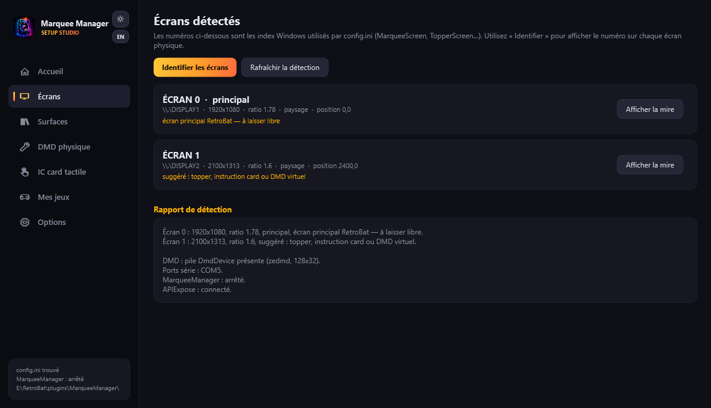
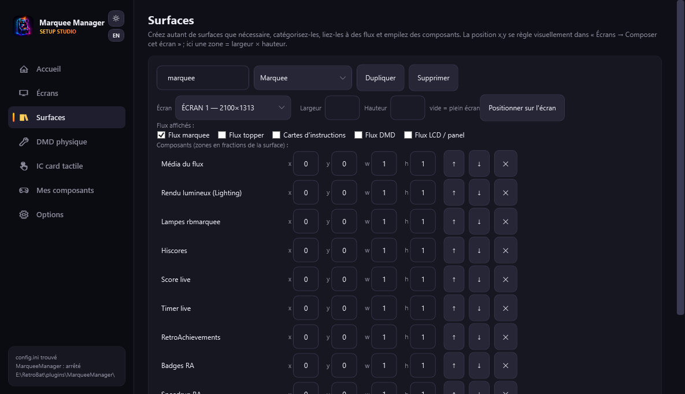
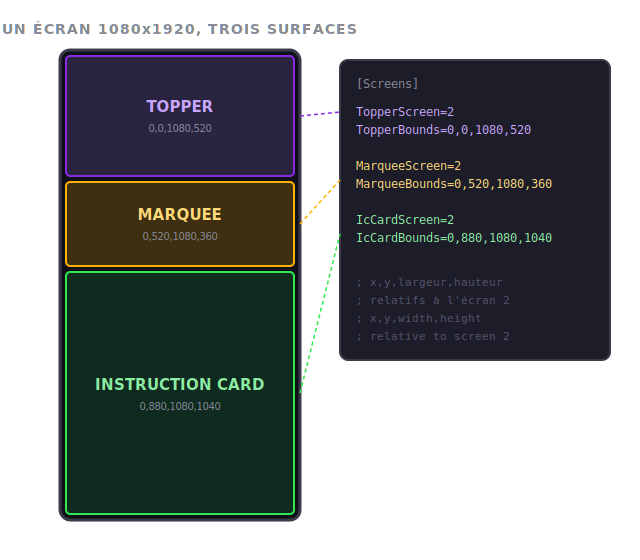
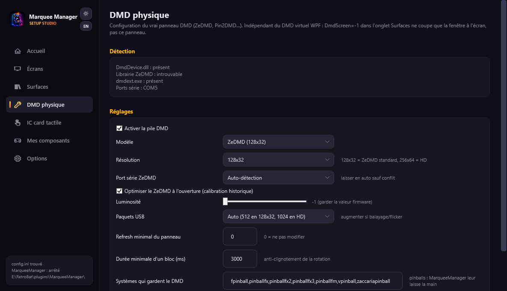
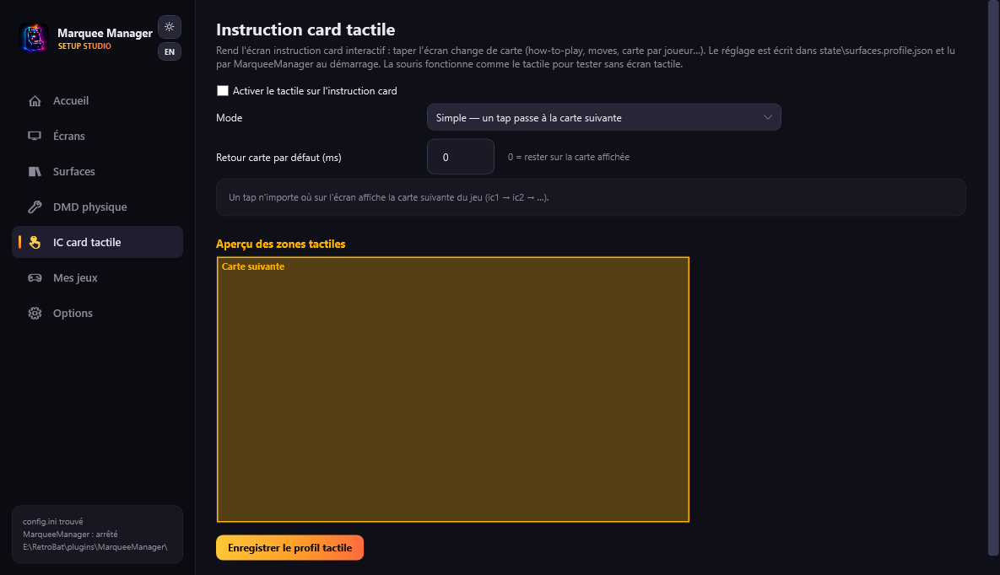
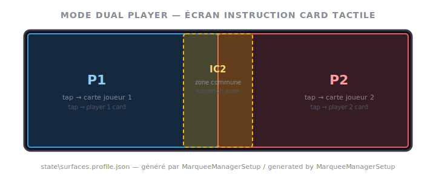

# The setup assistant

`MarqueeManagerSetup.exe`, at the root of the plugin, is the visual tool that configures your screens without editing `config.ini` by hand. It detects your displays, helps you decide which one is the marquee, the topper or the instruction card, configures the physical DMD and even prepares touch interaction — then writes the configuration cleanly (with a `.bak` backup, never touching the file's comments).

It offers five tabs in the sidebar.

!!! note "French or English"
    The assistant follows RetroBat's language (EmulationStation setting), else Windows'. To force it: `MarqueeManagerSetup.exe --lang fr` or `--lang en`.

## Screens

The starting tab: every Windows display detected, with its number, resolution, ratio and touch detection.

- **Identify screens** shows a big "ÉCRAN n" badge on each physical display for a few seconds — no more guessing which Windows index maps to which cabinet screen.
- **Show test pattern** fills a screen with a calibration pattern (grid, border, center cross). Click it to close.
- The **detection report** at the bottom sums everything up: screens and suggestions ("ratio 5.33, suggests marquee"), DMD stack, serial ports, MarqueeManager and APIExpose status.

!!! note "The numbers shown are the config.ini ones"
    The assistant enumerates screens exactly like the runtime: the number displayed is the one used by `MarqueeScreen`, `TopperScreen`, and so on.

## Surfaces

The heart of the tool: for each of the five surfaces (marquee, topper, instruction card, virtual DMD, LCD panel), pick:

- **the screen** it appears on (or "Disabled");
- **the content**: any surface can show any stream — for instance the instruction card on the topper when you have no dedicated screen;
- **the zone**: fullscreen, or an `x,y,width,height` rectangle to share one large vertical display between topper, marquee and instruction card:

**Test the zone** shows the pattern exactly where it will land, before saving. The assistant refuses invalid zones, flags overlaps and asks for confirmation before writing. If MarqueeManager is still running, it offers to restart it with the new configuration.

!!! tip "Screen powered off?"
    If a configured screen is off while you tweak, the assistant says so and **keeps** its assignment instead of overwriting it.

## Physical DMD

Configuration of the `[DMD]` section: model (ZeDMD, ZeDMD HD, Pin2DMD, PinDMD v3…), resolution, serial port, brightness, USB packet size. The tab also checks that the DMD stack is in place (DmdDevice/ZeDMD DLLs, `dmdext.exe`) and lists detected serial ports.

**Show a pattern on the DMD** sends dmdext's test pattern to the panel — the panel must be powered; the assistant stops MarqueeManager for the duration of the test.

!!! warning "Virtual DMD ≠ physical DMD"
    `DmdScreen=-1` in the Surfaces tab only disables the on-screen DMD window. The real panel is configured here.

## Touch IC card

If your instruction card screen is touch-capable (or even mouse-driven), this tab makes it interactive. Four modes:

- **Simple**: a tap anywhere shows the game's next card (how-to-play → moves → …).
- **Center → IC2**: pressing the center shows the secondary card (special moves, for instance), then automatically returns to the main card after the chosen delay.
- **Dual player**: for a screen shared by two players — the left half shows player 1's card, the right half player 2's, with an optional common zone in the middle:

- **Free zones**: draw your own zones directly on the preview (click-drag) and pick each one's action: next card, a specific card, a player card, back to the default card.

The setting is saved to `state\surfaces.profile.json` and read by MarqueeManager at startup. The mouse triggers the same actions as touch — handy to test without a touchscreen.

!!! note "Card naming (APIExpose media)"
    In a game's `artwork\ic`: `ic.png` for a single card, or `ic-1.png`, `ic-2.png`… for several cards. The `-left`/`-right` suffixes (e.g. mercs: `ic-1-left.png` … `ic-5-right.png`) are the **two card holders of the panel**: player 1 side and player 2 side. Navigation moves from card to card (ic-1 → ic-2…), and dual player mode shows the side of the player who tapped; `ic2` in an action means logical card #2, regardless of the file count.

## Options

Everything else, presented as simple switches:

- **Connection**: APIExpose address with a test button.
- **Lighting**: the marquee Lighting Engine — quality/performance, framing, glass reflection, tube sounds.
- **MAME layouts**: `.lay` file support for marquee, topper, iccard and DMD.
- **RetroAchievements**: per-surface activation, badges, unlock takeover.
- **Live score and timer**: the real-time overlays on the marquee and the DMD.

Fine-grained settings (durations, thresholds…) remain available in `config.ini`, where every option is commented — the assistant never destroys those comments.
