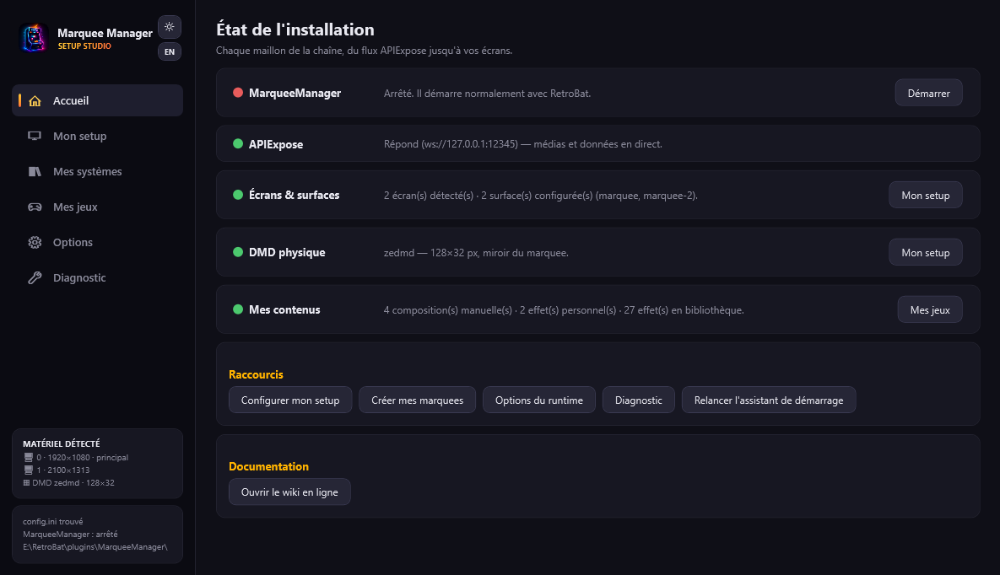
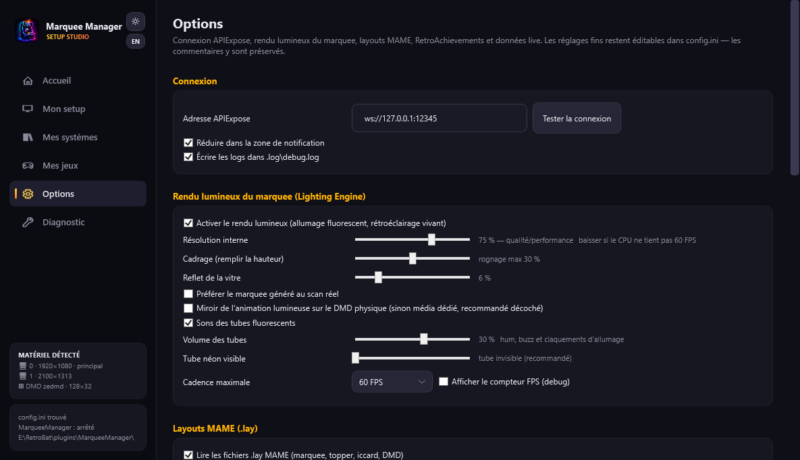
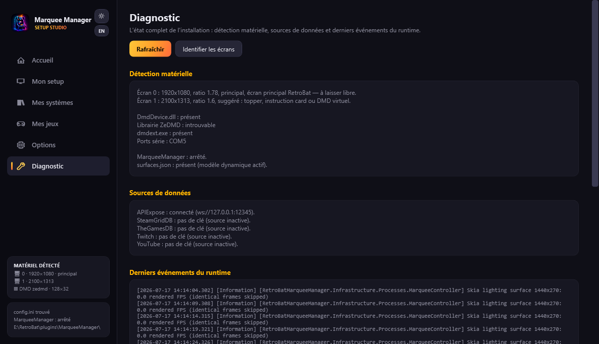

# L'assistant de configuration

`MarqueeManagerSetup.exe`, à la racine du plugin, est l'outil visuel qui configure tout sans éditer `config.ini` à la main — et écrit proprement la configuration (avec sauvegarde `.bak`, sans toucher aux commentaires du fichier).

!!! note "Français ou anglais"
    L'assistant s'affiche dans la langue de RetroBat (réglage EmulationStation), sinon celle de Windows — et se bascule à tout moment avec le bouton FR/EN du rail (choix mémorisé). Pour forcer : `MarqueeManagerSetup.exe --lang fr` ou `--lang en`.

## Premier lancement : trois étapes

Au tout premier démarrage, un assistant de bienvenue fait tout en moins de trois minutes :

1. **« Nous avons détecté N écrans »** — identification par grands numéros ;
2. **un type pré-choisi par écran** d'après sa forme (un bandeau 5:1 → Marquee ?) — corrigez d'un clic ;
3. **« Votre setup est prêt »** — surfaces et composants par défaut posés, mires de confirmation, runtime démarré.

« Configurer plus tard » saute l'assistant (relançable depuis l'Accueil). Naviguez ensuite dans EmulationStation : vos marquees s'affichent.

## Les six vues du rail

| Vue | Ce qu'on y fait |
|---|---|
| **Accueil** | Santé de l'installation, raccourcis, relance de l'assistant de démarrage |
| **[Mon setup](mon-setup.md)** | Le plan de vos écrans : types zéro-config, surfaces, création graphique, états d'affichage, mires, DMD physique, tactile |
| **[Mes systèmes](mes-systemes.md)** | Par système : priorités des sources, templates automatiques, dossier de médias personnels, pré-génération |
| **[Mes jeux](mes-jeux.md)** | La fiche d'un jeu : créations graphiques par surface, médias en ligne, effets pendant la partie, lampes, éclairage |
| **Options** | Connexion APIExpose, Lighting Engine, layouts MAME, RetroAchievements, score/timer live, sources en ligne (clés API, compte ScreenScraper) |
| **Diagnostic** | Rapport de détection (écrans, DMD, ports), état des sources, derniers événements du runtime |

## Accueil

Une carte d'état par maillon de la chaîne, avec pastille verte/orange/rouge et actions : MarqueeManager (Démarrer/Arrêter), APIExpose, Écrans & surfaces, DMD physique (orange si le panneau configuré est débranché) et Mes contenus (créations graphiques, effets personnels). Sous la navigation, la carte **Matériel détecté** liste vos écrans et le DMD.

## Options

Tout le reste, présenté en réglages simples :

- **Connexion** : adresse d'APIExpose avec bouton de test.
- **Rendu lumineux** : le Lighting Engine du marquee — qualité/performance, cadrage, reflet de vitre, sons des tubes.
- **Layouts MAME** : lecture des fichiers `.lay` pour marquee, topper, iccard et DMD.
- **RetroAchievements** : activation par surface, badges, plein écran d'unlock.
- **Score et timer live** : les overlays temps réel sur le marquee et le DMD.
- **Sources en ligne** : clés SteamGridDB/TheGamesDB/Twitch/YouTube et compte **utilisateur** ScreenScraper (repris d'EmulationStation si vide).

Les réglages fins (durées, seuils…) restent accessibles dans `config.ini`, dont chaque option est commentée — l'assistant n'écrase jamais ces commentaires.

## Diagnostic

« Pourquoi mon écran est noir ? » — le rapport de détection complet (écrans avec suggestions, pile DMD, ports série), l'état des sources de données (APIExpose testé, clés renseignées ou non) et les derniers événements du fichier de log du runtime.
