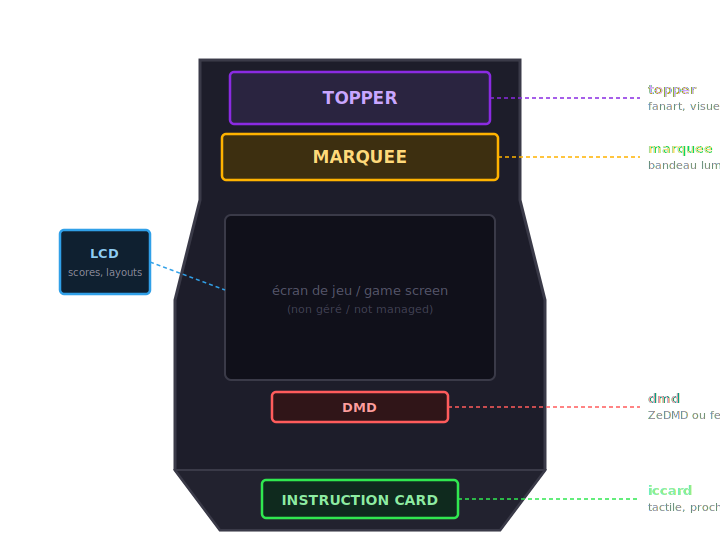

# Écrans et surfaces

MarqueeManager peut animer **cinq surfaces**, chacune étant une fenêtre WPF placée sur l'écran Windows de votre choix :

| Surface | Usage typique | Flux APIExpose |
|---|---|---|
| `marquee` | Le bandeau lumineux au-dessus de la borne | `/ws/marquee` |
| `topper` | L'écran tout en haut du fronton | `/ws/topper` |
| `iccard` | La carte d'instructions du jeu | `/ws/instruction-card` |
| `dmd` (virtuel) | Un DMD affiché sur un écran classique | `/ws/marquee` (média DMD) |
| `lcd` | Écran d'informations : scores, défis, leaderboards | `/ws/score`, `/ws/timer`, `/ws/retroachievements` |

## Assigner les écrans

!!! tip "Le plus simple : l'assistant"
    [`MarqueeManagerSetup.exe`](assistant.md) fait tout cela visuellement : identification des écrans, affectation des surfaces, test des zones, sans éditer le fichier.

Tout se passe dans `config.ini`, section `[Screens]` : chaque surface reçoit l'**indice de l'écran Windows** qui doit l'afficher.

- `-1` désactive une surface ;
- plusieurs indices séparés par des virgules dupliquent la surface sur plusieurs écrans.

!!! tip "Trouver l'indice d'un écran"
    Le bouton « Identifier les écrans » de l'assistant affiche le bon numéro sur chaque écran. (Dans Windows, Paramètres → Affichage → « Identifier », l'indice MarqueeManager commence généralement à 0 — si le résultat n'est pas celui attendu, essayez le numéro Windows moins un.)

## Ce qui s'affiche, couche par couche

Le média fourni par APIExpose (logo, marquee du jeu, vidéo) reste la **couche de fond**. Par-dessus, MarqueeManager compose des couches natives :

- les vues `.lay` MAME avec leurs lampes pilotées par le flux `/ws/arcade` ;
- les informations persistantes (score RA, mode de jeu) ;
- les notifications temporaires (succès débloqué, défi, résultat de leaderboard) ;
- les **effets lumière ingame** : flash rouge sur un coup reçu, blackout au
  game over, pulse sur un gain de vie… déclenchés par les moments du jeu.

??? note "Sous le capot — personnaliser les effets lumière"
    Les règles vivent dans un **XML éditable** : chaque règle matche une action
    (`LOSE_LIFE|KO|CRASH`) ou une **famille** entière (`family='scoring.'`),
    avec type d'effet (`flash`, `blackout`, `pulse`), couleur, durée et
    anti-spam (`throttleMs`) — la première règle qui matche gagne. Quand
    l'événement porte sa **propre couleur** (deltas de score arcade), elle
    prime sur celle de la règle. En session speedrun propre, les effets sont
    coupés automatiquement.

Sur le **LCD**, les cartes actives se répartissent dans une grille horizontale à colonnes égales ; en mode speedrun, la carte leaderboard devient un bandeau bas pleine largeur pour rester lisible.

## Reconnexions

Si APIExpose redémarre, chaque flux se reconnecte automatiquement après cinq secondes — aucune intervention nécessaire.
