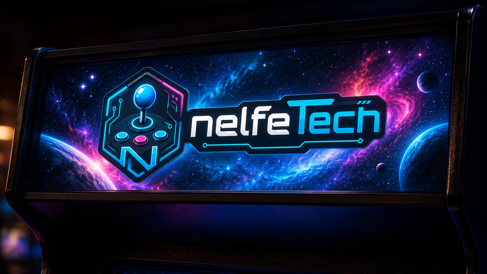

# Welcome

**MarqueeManager** dresses your cabinet with screens that live with your RetroBat games: the marquee shows the selected game's logo, the topper follows along, the DMD animates like a pinball machine, and live scores, RetroAchievements and MAME lamps display in real time.



## What MarqueeManager does

- **Five display surfaces**: marquee, topper, instruction card, virtual DMD and LCD — each on the Windows screen of your choice.
- **Physical DMD**: ZeDMD and compatibles, with automatic firmware optimization and crisp 128×32 rendering.
- **Real time**: live scores, timers, RetroAchievements notifications and challenges, MAME `.lay` layout lamps.
- **Zero scraping**: all media and data come from APIExpose — MarqueeManager contacts no external API and generates no media.

## Where to start?

<div class="grid cards" markdown>

- **[Getting started](premiers-pas.md)** — install MarqueeManager in 5 minutes.
- **[Screens and surfaces](ecrans.md)** — assign each surface to a Windows screen.
- **[DMD and ZeDMD](dmd.md)** — plug in and tune your physical or virtual DMD.
- **[Troubleshooting](depannage.md)** — solutions to common issues.

</div>

## How it works

```text
APIExpose (media + data, real time)
   → MarqueeManager (WebSockets /ws/marquee, /ws/topper, /ws/score…)
      → WPF surfaces (marquee, topper, iccard, dmd, lcd)
      → physical DMD (dmd/zedmd DLLs + dmdext for video)
```

MarqueeManager is part of the RetroBat plugin family together with [APIExpose](https://github.com/Nelfe80/RetroBat-APIExpose) (the data engine, **required**) and [LedManager](https://github.com/Nelfe80/RetroBat-Led-Manager) (LED buttons and panels).
