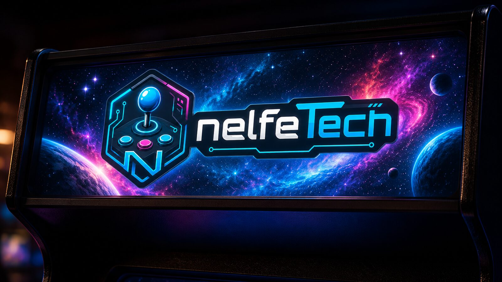
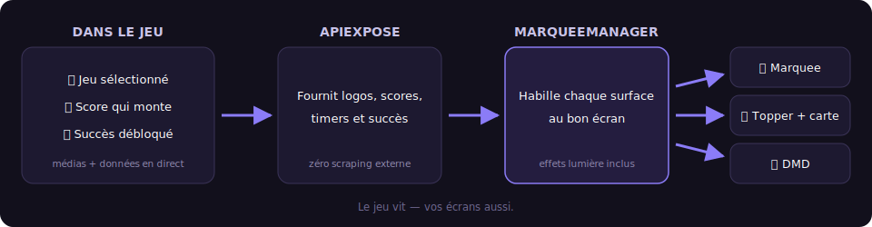

# Bienvenue

**MarqueeManager** habille votre borne d'écrans qui vivent avec vos jeux RetroBat : le marquee affiche le logo du jeu sélectionné, le topper suit, le DMD s'anime comme sur un flipper, et les scores, succès RetroAchievements et lampes MAME s'affichent en temps réel.



## Ce que fait MarqueeManager

- **Cinq surfaces d'affichage** : marquee, topper, carte d'instructions, DMD et LCD — chacune sur l'écran Windows de votre choix.
- **DMD virtuel ou physique, au choix** : une fenêtre DMD sur n'importe quel écran, ou un vrai panneau ZeDMD (et compatibles) avec optimisation automatique du firmware et rendu net en 128×32 — les deux affichent exactement la même chose.
- **Temps réel** : scores live, timers, notifications et défis RetroAchievements, lampes des layouts `.lay` MAME.
- **Zéro scraping** : tous les médias et données viennent d'APIExpose — MarqueeManager ne contacte aucune API externe et ne génère aucun média.

## Par où commencer ?

<div class="grid cards" markdown>

- **[Premiers pas](premiers-pas.md)** — installer MarqueeManager en 5 minutes.
- **[Écrans et surfaces](ecrans.md)** — assigner chaque surface à un écran Windows.
- **[DMD et ZeDMD](dmd.md)** — régler votre DMD, virtuel ou physique.
- **[Dépannage](depannage.md)** — les solutions aux problèmes courants.

</div>

## Comment ça marche



??? note "Sous le capot — le pipeline complet"

    ```text
    APIExpose (médias + données, temps réel)
       → MarqueeManager (WebSockets /ws/marquee, /ws/topper, /ws/score…)
          → surfaces WPF (marquee, topper, iccard, dmd virtuel, lcd)
          → DMD physique optionnel (DLL dmd/zedmd + dmdext pour la vidéo)
    ```

MarqueeManager fait partie de la famille de plugins RetroBat avec [APIExpose](https://github.com/Nelfe80/RetroBat-APIExpose) (le moteur de données, **requis**) et [LedManager](https://github.com/Nelfe80/RetroBat-Led-Manager) (boutons et panneaux LED).
