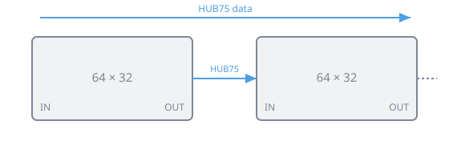
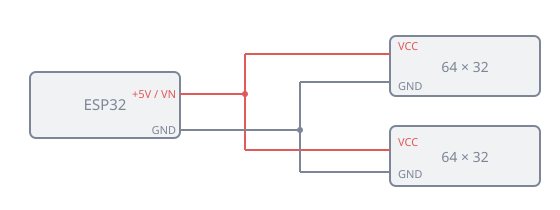

# Matériel

MarqueeManager pilote les **écrans secondaires** d'une borne — tout ce qui n'est pas l'écran de jeu. Cette page présente les **types d'écrans** que vous pouvez lui confier, puis détaille comment **construire un vrai DMD** à base de panneaux LED.

## Les types d'écrans

Vous branchez ces écrans comme des moniteurs supplémentaires ; MarqueeManager leur affecte une **surface** (voir [Mon setup](mon-setup.md), qui les identifie et les place).

| Écran | Rôle | Matériel courant |
|---|---|---|
| **Marquee** | Le bandeau d'enseigne en haut de la borne (jaquette animée, logo, jeu en cours) | Moniteur LCD large — souvent un format **ultra-large** (ex. 19"×6", 1920×540) glissé dans l'emplacement du marquee rétroéclairé d'origine |
| **Topper** | Un écran au **sommet** de la borne, au-dessus du marquee | Petit LCD 16:9 |
| **DMD** | L'afficheur à **matrice de points** (scores, animations façon flipper/arcade) | Un **vrai DMD à LED** (panneaux HUB75 + ZeDMD, décrit plus bas) **ou** un petit LCD qui le simule |
| **Écran de contrôle / LCD** | Cartes d'instructions, jaquette secondaire, second joueur… | LCD au format souhaité |

!!! note "Un moniteur = une sortie vidéo"
    Chaque écran est un affichage Windows à part entière, relié à une sortie de la carte graphique (HDMI/DisplayPort) ou à un adaptateur USB→HDMI. Le DMD à LED fait exception : il ne se branche **pas** en vidéo mais en **USB** (voir ci-dessous).

## Construire un DMD ZeDMD (128 × 32)

Un vrai DMD se fabrique avec **deux panneaux LED HUB75 de 64 × 32**, mis côte à côte pour former un **128 × 32**, pilotés par un microcontrôleur **ESP32** sous le firmware **[ZeDMD](https://github.com/PPUC/ZeDMD)**. Le tout se branche en USB et ne demande **aucune alimentation 5 V externe**.

Deux contrôleurs possibles :

- **ESP32 classique** — idéal si vous avez déjà un montage existant ;
- **ESP32-S3 DevKitC-1 N16R8** — recommandé pour un nouveau montage.

### Ce qu'il vous faut

- 2 panneaux LED **HUB75** de 64 × 32 ;
- 1 **ESP32** classique **ou** 1 **ESP32-S3** N16R8 ;
- 1 **carte contrôleur** (la platine qui reçoit l'ESP32) ;
- 1 **nappe HUB75** entre les deux panneaux ;
- les **fils de liaison** (Dupont) entre la carte et le panneau gauche — câblés signal par signal (voir le tableau HUB75) ; si votre carte possède un connecteur HUB75 en sortie, une **nappe HUB75** suffit ;
- les **câbles d'alimentation** (+5 V et masse) vers les deux panneaux ;
- 1 **câble USB** (data, pas un câble de charge seul) ;
- support, vis, entretoises et colliers (serre-câbles) ;
- un **multimètre** recommandé pour contrôler la polarité.

| | ESP32 classique | ESP32-S3 |
|---|---|---|
| **Firmware** | `ZeDMD 128x32` | `ZeDMD S3 128x32` |
| **USB** | Port de la carte | USB-C **gauche** `CDC` |
| **+5 V panneaux** | `5V` ou `VIN` | `VN` |
| **Masse** | `GND` | `GND` |

### 1. Assembler les deux panneaux

Placez les panneaux côte à côte, **dans le même sens**, en suivant les flèches de sens des données imprimées au dos.

{ width="560" }

1. Reliez la sortie `HUB75 OUT` du panneau **gauche** à l'entrée `HUB75 IN` du panneau **droit** avec la nappe HUB75.
2. Respectez le sens des flèches (les données circulent de gauche à droite).
3. Laissez `OUT` du panneau **droit** libre.
4. N'insérez jamais un connecteur en forçant.

La résolution finale est de **128 × 32 pixels**.

### 2. Installer le contrôleur

1. Débranchez l'USB.
2. Alignez l'ESP32 avec sa carte contrôleur.
3. Vérifiez qu'**aucune broche n'est décalée**.
4. Enfoncez le contrôleur progressivement.
5. Gardez le connecteur USB accessible.

Sur l'**ESP32-S3**, utilisez **exclusivement le port USB-C gauche `CDC`** pour le flashage, les données et l'alimentation.

### 3. Câbler le HUB75 (signal par signal)

Reliez la carte au connecteur `HUB75 IN` du panneau **gauche**. Sur la carte, les broches de données sont repérées `D*` (`D25`, `D4`…) : `GPIO25` dans le firmware correspond à `D25` sur la carte. Sur certaines cartes S3, seul le nombre est imprimé (`4` = `D4`).

| Signal HUB75 | ESP32 classique | ESP32-S3 |
|---|---:|---:|
| R1 | D25 | D4 |
| G1 | D26 | D5 |
| B1 | D27 | D6 |
| R2 | D14 | D7 |
| G2 | D12 | D15 |
| B2 | D13 | D16 |
| A | D23 | D18 |
| B | D19 | D8 |
| C | D5 | D3 |
| D | D17 | D42 |
| E | D22 | D1 |
| CLK | D16 | D41 |
| LAT / STB | D4 | D40 |
| OE | D15 | D2 |
| Masse logique | GND | GND |

!!! warning "Les repères `D*` sont des broches de données"
    Un `D*` ne doit **jamais** servir à l'alimentation. Reliez un signal à la fois, contrôlez chaque liaison, terminez par la masse logique, et vérifiez qu'aucun fil `D*` ne touche une broche `VCC`/`5V`.

### 4. Alimenter les panneaux

Les deux panneaux sont alimentés **en parallèle** depuis la carte : le 5 V qu'elle fournit convient, sans surtension ni bavure.

{ width="560" }

1. Débranchez l'USB.
2. Repérez `5V`/`VIN` (ESP32 classique) ou `VN` (S3), puis `GND`.
3. Reliez le **+5 V** aux deux entrées `VCC` des panneaux.
4. Reliez `GND` aux deux `GND` des panneaux.
5. Contrôlez la **polarité** au multimètre, puis isolez et fixez les connexions.

!!! danger "Polarité"
    Une inversion entre `VCC` et `GND` peut **endommager** les panneaux et le contrôleur. Vérifiez avant de brancher l'USB.

### 5. Fixer le tout

Sur une plaque arrière : les deux panneaux alignés, la carte sur **entretoises** (jamais posée directement sur du métal), les nappes sans pli excessif, les fils tenus par des colliers, et le câble USB retenu par un **serre-câble anti-arrachement**.

## Flasher et configurer avec ZeDMD Updater 2

Le firmware s'installe et se règle avec l'outil Windows **[ZeDMD Updater 2](https://github.com/zesinger/ZeDMD_Updater2)**. Il détecte les ports COM, flashe l'ESP32 ou le S3, et configure l'ordre RGB, la luminosité et les paramètres USB.

### Brancher et repérer le contrôleur

Branchez le câble USB (port de la carte pour l'ESP32 classique ; USB-C **gauche** `CDC` pour le S3). Le port doit apparaître dans le **Gestionnaire de périphériques → Ports (COM et LPT)**, puis dans la liste de [ZeDMD Updater 2](https://github.com/zesinger/ZeDMD_Updater2).

Un contrôleur non flashé peut s'afficher `Stock ESP32` (classique) ou `Unknown` (S3). Le **S3 n'est pas toujours reconnu automatiquement** : repérez son port COM, double-cliquez sur `no` dans la colonne `S3` pour le passer à `yes`.

### Flasher le bon firmware

| Contrôleur | Firmware |
|---|---|
| ESP32 classique | `ZeDMD 128x32` |
| ESP32-S3 | `ZeDMD S3 128x32` |

Choisissez une version officielle et la résolution **128 × 32**, puis `Download and flash` (ou `Flash from a file` avec le bon `ZeDMD.bin`).

!!! note "ESP32 classique bloqué au flashage"
    Si le flashage reste sur les points de connexion : maintenez `BOOT` **et** `RST`, relâchez `RST`, puis `BOOT`, et attendez le démarrage du flashage (parfois à répéter). Le S3 ne demande normalement aucune action sur les boutons.

### Régler le DMD

Resélectionnez le contrôleur dans l'Updater, puis :

- **Résolution** : `128 × 32`.
- **Ordre RGB** : le logo de test doit afficher **rouge en haut à gauche, vert en bas à gauche, bleu en haut à droite**. Changez `RGB Order` jusqu'au bon rendu.
- **Luminosité** : commencez bas, augmentez progressivement.
- **Taille des paquets USB** : viser `512` (ESP32 classique) ou `1024` (S3) — commencez plus bas et montez tant que l'image reste stable.
- **Rafraîchissement** : environ `90 Hz` pour un 128 × 32 ; réduisez en cas d'instabilité.

Terminez par `Set new parameters` et attendez la fin de l'écriture avant de débrancher. Le flashage seul **n'applique pas** ces réglages : configurez-les après.

### Premier test

Rebranchez l'USB et attendez le **logo ZeDMD** : les deux panneaux doivent former **une seule image**, aux bonnes couleurs, sans scintillement ni bavure, et sans redémarrage du contrôleur.

Côté RetroBat, l'affichage du DMD (rendu 128 × 32, rotation, jeux de pinball…) se règle dans [DMD et ZeDMD](dmd.md).

## Dépannage matériel

| Symptôme | À vérifier |
|---|---|
| **Aucun affichage** | Câble USB (data), firmware flashé, `VCC`/`GND`, `HUB75 IN`, et les signaux `CLK`, `LAT`, `OE` |
| **Un seul panneau s'allume** | La nappe entre `OUT` gauche et `IN` droit, et l'alimentation du panneau droit |
| **Couleurs fausses** | L'`RGB Order` dans ZeDMD Updater 2 |
| **Scintillement / redémarrages** | Baisser la luminosité, la taille des paquets USB ou le rafraîchissement ; essayer un autre câble ou port USB |
| **ESP32 impossible à flasher** | La manipulation `BOOT` + `RST` |
| **S3 : mauvais firmware** | Passer la colonne `S3` à `yes`, puis reflasher `ZeDMD S3 128x32` |

## Sources

- **ZeDMD** (firmware) : [github.com/PPUC/ZeDMD](https://github.com/PPUC/ZeDMD)
- **ZeDMD Updater 2** (outil de flashage/config) : [github.com/zesinger/ZeDMD_Updater2](https://github.com/zesinger/ZeDMD_Updater2)
