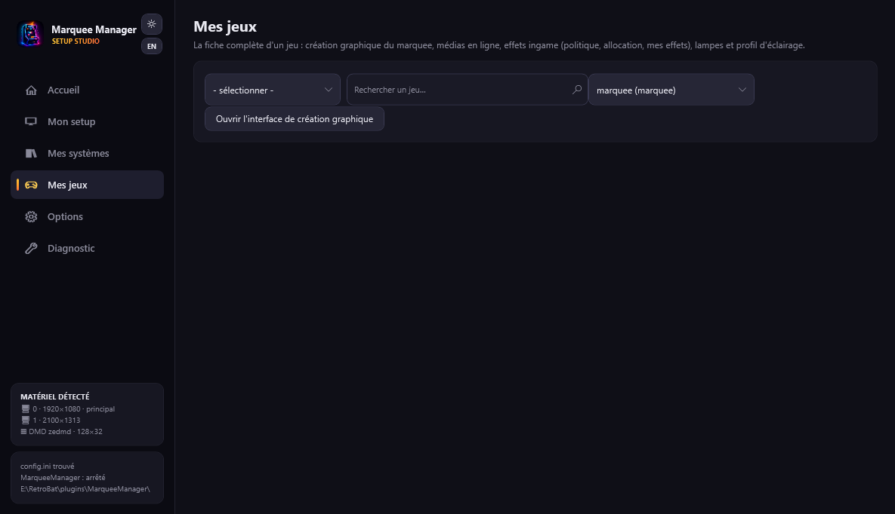

# Mes jeux

**Mes jeux** est la fiche complète d'un jeu : le marquee qu'il affiche, ses créations graphiques, ses médias en ligne, ses **effets pendant la partie**, ses lampes et son éclairage.

## Trouver un jeu

Choisissez un système (seuls les systèmes avec des **jeux installés** dans `roms\` apparaissent — la famille arcade est regroupée), puis tapez un nom de jeu ou de rom : « lunar » trouve *Lunar Lander* (`llander`), même sans médias scrapés. Les noms viennent de votre gamelist, complétés par la bibliothèque APIExpose.

## Le marquee affiché

La fiche montre **le marquee actuellement affiché** pour ce jeu et sa **source** (votre création, votre dossier, le scrapé, le généré…), résolue par la règle de priorité du système — le lien ouvre Mes systèmes pour la modifier. Si la source vous appartient (création ou fichier de votre dossier), un bouton la **supprime** : la source suivante de la chaîne reprend la main.

## Créations graphiques — une par surface

Chaque **surface a sa propre création** : une création A sur la surface marquee et une création B sur le topper peuvent coexister pour le même jeu. La fiche liste les créations existantes (cliquer = éditer celle-là) ; « **Ouvrir l'interface de création graphique** » crée la vôtre pour la surface choisie dans le sélecteur.

L'interface : cible (écran/surface) en haut, **médias par type** à gauche (clic = choisir la version dans une modale par source, gradients statiques inclus), canvas au centre (glisser, molette = taille, Maj+molette = rotation), **calques** à droite (œil, cadenas, glisser-déposer pour l'ordre) avec l'inspecteur du calque sélectionné (taille, rotation, opacité, texte, miroir).

## Récupérer des médias en ligne

Arcade Database (sans clé), SteamGridDB, TheGamesDB — clés dans Options → Sources en ligne. Cliquez sur un média pour l'importer : il devient disponible dans l'interface de création graphique (médias téléchargés).

??? note "Et ScreenScraper ?"
    La source ScreenScraper n'apparaît que si les identifiants **développeur** sont disponibles (jamais distribués dans le code) ; votre compte **utilisateur** est repris d'EmulationStation ou saisi dans Options. APIExpose scrape déjà ScreenScraper localement — cette source directe est un complément, décochée par défaut.

## Gestion des effets pendant la partie

Les jeux équipés d'une définition `.MEM` (badge  MEM sur la fiche) émettent des **signaux sémantiques** (HIT, LOSE_LIFE, BOSS_DEFEATED…). Chaque ligne se lit « Quand [signal] alors [effet] », avec une puce d'état : **grise** = aucun effet, **orange** = effet par défaut, **verte** = votre réglage. Cliquer une ligne (ou « Lier un effet à un signal… ») ouvre l'éditeur dédié : signal, effet simple ou un de **Mes effets**, préview, enregistrer.

### Mes effets

Un effet nommé = une **pile d'actions ordonnancées** (voile, flash, secousse, strobe, sprites, votre média webm/gif) avec départ et durée. Les sprites règlent leur **taille (jusqu'à 1000 %, pixels nets)**, leur **grossissement** et leur **position** (hasard bien espacé, centre, réguliers) ; les sprites `full_*` sont des fonds uniques pleine largeur. La bibliothèque livre des effets officiels (★, non supprimables — dupliquez-les) et vos créations dans `media\effects\library.json`.

### Politique par jeu

**Hériter** (défauts genre/système + vos réglages), **Uniquement mes effets**, ou **Tout désactiver**. Le moniteur live affiche les signaux qui tirent pendant que vous jouez.

## Mon marquee dynamique Arcade

C'est le marquee affiché **pendant la partie** : les outputs MAME du jeu allument les lampes que vous posez, comme le fronton de la borne d'origine. Fond au choix (marquee généré en priorité), lampes cercle/rectangle avec position et dimensions précises, câblage aux outputs du jeu, liste détaillée, et un bouton **teste l'attract mode** (chenillard, alterné). La scène s'enregistre dans `resources\rbmarquee\<rom>.xml` et le générateur ne l'écrase plus.
