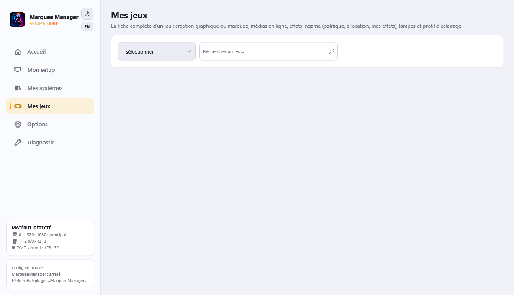

# Mes jeux

**Mes jeux** est la fiche complète d'un jeu : le marquee qu'il affiche, ses créations graphiques, ses médias en ligne, ses **effets pendant la partie**, ses lampes et son éclairage.

## Trouver un jeu

Choisissez un système (seuls les systèmes avec des **jeux installés** dans `roms\` apparaissent — la famille arcade est regroupée), puis tapez un nom de jeu ou de rom : « lunar » trouve *Lunar Lander* (`llander`), même sans médias scrapés. Les noms viennent de votre gamelist, complétés par la bibliothèque APIExpose.

## Mon marquee

Choisissez la **surface** (les surfaces suspendues sont masquées par défaut) : sous le sélecteur, les mêmes **cartes de résolution** que dans Mes systèmes, du plus général au plus précis — **Gabarit général**, **Ma création pour ce jeu**, **Mon dossier médias**, **Marquee scrapé**, **Logo mis en page**. Chaque carte a son aperçu ; **cliquer une carte** l'utilise pour **ce jeu** (un override propre au jeu) et la **coche verte ✓** marque celle qui s'affiche.

Le **compositeur** et la **suppression** vivent sur la carte « Ma création pour ce jeu » (**Composer / Modifier**, **Supprimer**). Chaque **surface a sa propre création** : changez de surface pour voir et éditer celle de chaque surface.

Le sélecteur de systèmes commence par « **Tous les jeux** » : c'est le gabarit de **dernier recours**, celui qui habille un jeu dont ni sa fiche ni son système ne dit rien. En dessous, le **gabarit général des jeux est par système** : « Modifier le gabarit général » compose une mise en page générique qui s'applique à **tous les jeux de ce système** (megadrive et nes peuvent avoir la leur), chaque jeu la recevant avec ses propres médias — et il l'emporte sur celui de « Tous les jeux ». Un système sélectionné donne aussi accès à « **Par défaut pour tous les jeux de ce système** » : la source à privilégier pour chaque jeu du système, qu'une fiche de jeu peut toujours remplacer. **Mon dossier médias** propose « **Ouvrir le dossier** » pour déposer un fichier brut (au niveau jeu : `media\marquees\user\<système>\<rom>.png`).

L'interface de création : cible (écran/surface) en haut, **médias par type** à gauche, canvas au centre, **calques** à droite (œil, cadenas, flèches ▲▼ et glisser-déposer pour l'ordre) avec l'inspecteur du calque.

**La palette liste tous les types composables**, qu'ils existent ou non pour l'échantillon : fanart, mix, logo, marquee, screen marquee, marquee et DMD générés, flyer, écran-titre, capture, boîte 3D, jaquette, bezel, plus le fanart, le logo et le marquee du **système**. Un type sans image derrière lui se pose en **carré de couleur** portant son nom — la mise en page se compose sur des **types**, l'image arrive jeu par jeu. La case « **Afficher les échantillons** » bascule la pile sur les vrais médias d'un jeu pour juger le rendu. Un type que les flux ne transportent pas est marqué : il se compose ici mais ne s'affichera pas sur la surface.

Côté texte : « Texte : nom du jeu », développeur, éditeur, année, **description**, genre, joueurs, note. La description se pose dans une **boîte** que les poignées redimensionnent dans les deux sens ; son **corps de texte** et ses **alignements** (gauche/centre/droite, haut/milieu/bas) se règlent dans les propriétés. Un calque qui ne porte qu'une balise n'a pas de champ de saisie : son contenu appartient au jeu.

Sur le canvas : glisser pour déplacer, molette = taille, Maj+molette = rotation, **poignées** de redimension et de rotation sur le calque sélectionné — le coin **opposé** à celui que vous saisissez reste fixe.

## Récupérer des médias en ligne

Arcade Database (sans clé), SteamGridDB, TheGamesDB — clés dans Options → Sources en ligne. Cliquez sur un média pour l'importer : il devient disponible dans l'interface de création graphique (médias téléchargés).

??? note "Et ScreenScraper ?"
    La source ScreenScraper n'apparaît que si les identifiants **développeur** sont disponibles (jamais distribués dans le code) ; votre compte **utilisateur** est repris d'EmulationStation ou saisi dans Options. APIExpose scrape déjà ScreenScraper localement — cette source directe est un complément, décochée par défaut.

## Gestion des effets pendant la partie

Les jeux équipés d'une définition `.MEM` (badge  MEM sur la fiche) émettent des **signaux sémantiques** (HIT, LOSE_LIFE, BOSS_DEFEATED…). Le fichier `.MEM` est retrouvé via le **référentiel d'alias** d'APIExpose (noms de dump, variantes, hashes) : le nom exact de votre fichier rom n'a pas besoin de correspondre. Chaque ligne se lit « Quand [signal] alors [effet] », avec une puce d'état : **grise** = aucun effet, **orange** = effet par défaut, **verte** = votre réglage. Cliquer une ligne (ou « Lier un effet à un signal… ») ouvre l'éditeur dédié : signal, effet simple ou un de **Mes effets**, préview, enregistrer. Pendant la partie, les effets s'affichent **quel que soit le média du marquee** — image, vidéo ou création graphique — en surimpression.

### Mes effets

Un effet nommé = une **pile d'actions ordonnancées** (voile, flash, secousse, strobe, sprites, votre média webm/gif) avec départ et durée. Les sprites règlent leur **taille (jusqu'à 1000 %, pixels nets)**, leur **grossissement** et leur **position** (hasard bien espacé, centre, réguliers) ; les sprites `full_*` sont des fonds uniques pleine largeur. La bibliothèque livre des effets officiels (★, non supprimables — dupliquez-les) et vos créations dans `media\effects\library.json`.

### Politique par jeu

**Hériter** (défauts genre/système + vos réglages), **Uniquement mes effets**, ou **Tout désactiver**. Le moniteur live affiche les signaux qui tirent pendant que vous jouez.

## Mon marquee dynamique Arcade

C'est le marquee affiché **pendant la partie** : les outputs MAME du jeu allument les lampes que vous posez, comme le fronton de la borne d'origine. L'aperçu prend **toute la largeur de la fiche**, fond au choix (marquee généré en priorité).

Lampes cercle ou rectangle : glisser = déplacer, **poignée** (ou molette) = redimensionner, **palette de couleurs** cliquable dans l'inspecteur (le code hexa reste disponible), position et dimensions précises. Le **câblage** se choisit strictement parmi les outputs réels du jeu — et le même output peut allumer **plusieurs lampes** (les deux LOCKON d'After Burner II, par exemple), une lampe pouvant aussi écouter plusieurs outputs. Liste détaillée des lampes et bouton **teste l'attract mode** (chenillard, alterné). La scène s'enregistre dans `resources\rbmarquee\<rom>.xml` et le générateur ne l'écrase plus.
