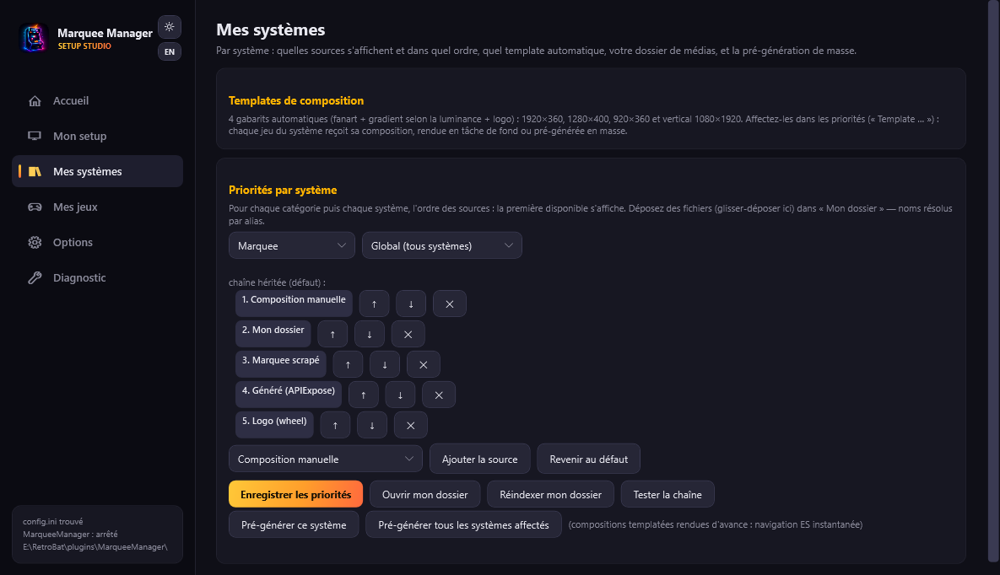

# My systems

**My systems** decides, system by system, **what shows up and in which order**: your graphic creations, your media, the scraped one, the generated one — plus the automatic template that builds a creation for every game.

## My marquee

The marquee shown when a **system** is selected in ES. Pick the system (only those with installed games appear; mame and fbneo keep their own creations): the current marquee preview, the **surface picker** (each creation belongs to one surface), “**Open the graphic creation interface**” and the **deletion of that surface's creation** then appear. The **system fanart** comes from the active ES theme (carbon ships one for almost every system).

## Per-system priorities

For each **category** (marquee, topper, DMD) then each system, an ordered chain of sources: the runtime displays the **first available** one. Sources: my graphic creation, my folder, template, scraped marquee, screen-marquee, APIExpose generated, logo, fanart… (DMD: your animated GIFs, `dmd*.gif`, `dmd.png`).

A typical arcade chain: *my creation > my folder > scraped marquee > generated*. **Test the chain** shows, right below, which source wins on a sample (works in Global too).

## My folder

Drop your media here (PNG/JPG images or MP4 videos): one file per game, named after the rom (“mslug.png”), the title (“Metal Slug (World).png”) or any alias — the name resolves automatically. They outrank other sources as soon as “My folder” is in the chain. Dragging & dropping straight onto the card works.

## Template pre-generation

A “Template” is an automatic creation (fanart + luminance-driven gradient + logo) rendered for **every game** of the system, in 1920×360, 1280×400, 920×360 or vertical 1080×1920. Add “Template …” to the chain to use it; rendering happens on first display, or ahead of time with **Pre-generate** for instant ES navigation (`MarqueeManager.exe --render-templates <system|all>`).
