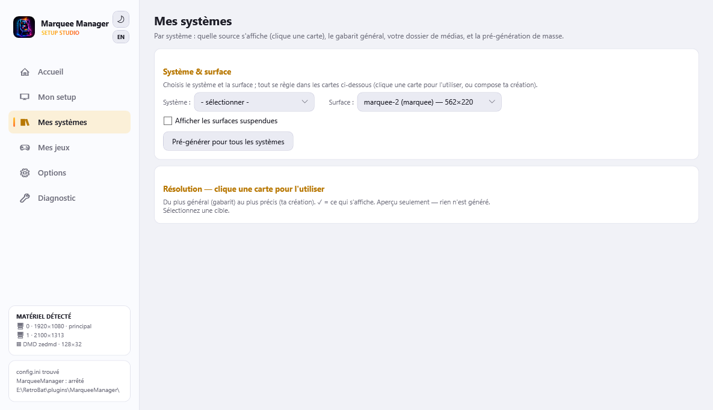

# My systems

**My systems** decides, system by system, **which source shows up** when a system is selected in ES. You no longer reorder a list: each source is a **card**, from the most general to the most specific, and you **click the card** you want to use.

## System & surface

Pick the **system** (only those with installed games appear; mame, fbneo… keep their own creations) and the **surface** on the same row. **Suspended** surfaces (whose screen is excluded from MarqueeManager) are hidden by default — a “Show suspended surfaces” box brings them back.

## The resolution cards

Below the pickers, one card per source, **from most general to most specific**:

- **General template — all systems**: the generic layout (see below), rendered with the current system's media.
- **My creation for this system**: your dedicated composition, with **Compose / Edit** and **Delete**.
- **My media folder**: a raw file you drop in (see below).
- **Scraped marquee** then **Laid-out logo**: the automatic sources.

Every card has its **own preview** (greyed “no media for this source” when empty, hence not selectable). **Clicking a card** activates it for this system + surface; the **green check ✓** marks the one that actually shows. The default precedence is fixed (creation > folder > template > scraped > logo); clicking a card forces it and disables the ones above.

The **system fanart** used by the compositions comes from the active ES theme (carbon ships one for almost every system).

## The general template

The **template** (“gabarit”) is a generic layout (fanart + gradient + logo, say) composed **once** and applied to **every system**: each layer is keyed by its type (fanart, logo…) and, at render time, resolves the current system's media. **Edit the general template** opens the very same composer as “Compose”, with generic layers.

**Pre-generate for all systems** renders the template for every system at once (instant ES navigation); otherwise it renders on the first visit to a system.

## My media folder

Drop a file (PNG/JPG) for a system: the card's **Open the folder** button creates and opens the exact location, even before anything is selected. At the **system** level the file takes the **system name as shown in ES** — e.g. `media\marquees\user\systems\mame.png` (not `arcade.png`). Once a file is present, the “My media folder” card becomes selectable and outranks the template and the scraped source.
