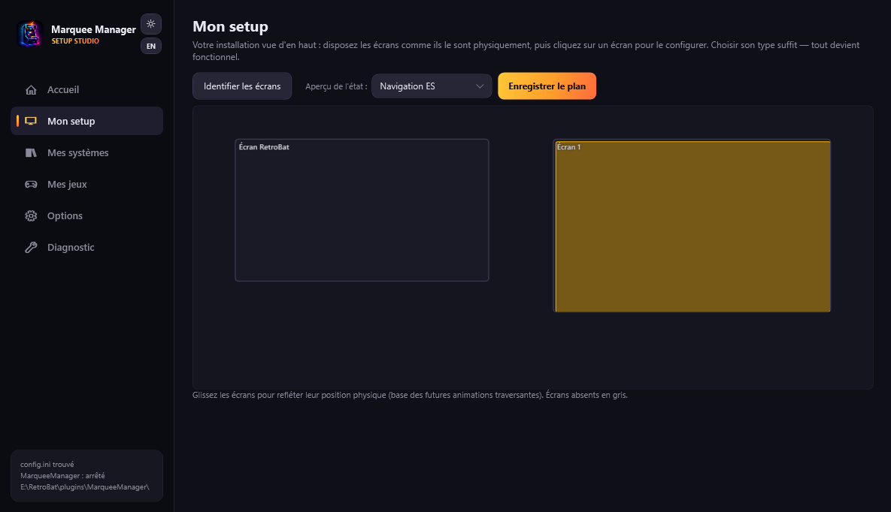

# My setup

**My setup** is the map of your installation: every detected screen appears where it physically sits (drag them to mirror your cabinet, cupboard or desk). From there, everything configures top-down: **the map → a screen → a surface → its composition**.

## One screen type = everything configured

Click a screen, pick its **type**, apply: default surfaces, components and streams are laid out — the screen works immediately.

| Type | What gets laid out |
|---|---|
| **Marquee** | Fullscreen surface: game media, lighting render (neon tubes), lamps, hiscores, live score/timer, RetroAchievements |
| **Topper** | Fullscreen topper surface |
| **Instruction card** | The game's instruction card (touch supported when the screen is) |
| **Virtual DMD** | A fullscreen DMD window |
| **Mixed vertical** | Marquee strip on top + instruction card at the bottom, **RetroBat/the game stays visible in the middle** |
| **Game screen** | Nothing: RetroBat owns it |
| **Custom** | An empty surface to compose |

The tool pre-suggests the type from the screen's shape (a 5:1 strip is probably a marquee). Experts then tweak anything: “Split / position surfaces” opens the visual zone editor (drag, resize, magnetic guides), including on the main screen.

## Display states

Every component belongs to a state: **ES browsing**, **Ingame**, or **Both** (default). A score board can thus show up only while playing, a video showcase only while browsing. The state selector above the map previews what each screen will show in each situation — your cabinet “lives” without launching anything.

## Composing a surface

“Compose” opens the composition editor, Photoshop logic:

- **left, the elements** by groups: media (fanart, 50 % logo, game video…), game info (title, year/publisher), live (hiscores, score, timer), RetroAchievements, decoration (readability gradient, text, embedded web, neon tubes) — plus one-click **composites**: *Marquee* (fanart+gradient+logo), *Full score*, *Live media*, *Twitch chat*;
- **center, the canvas** at the surface's real scale: drag, resize handle, magnetic guides, Del, Ctrl+D (duplicate), Ctrl+Z/Y (undo/redo) — with a real example game's media;
- **right, the layers** (eye to hide, padlock to lock, ↑↓ for z-order) and the **inspector**: layout (x, y, width, height as fractions — the composition survives any resolution change), content (visibility state, `{name}` `{year}` templates…), style.

The **ES browsing / Ingame / Both** tabs at the top filter editing per state.

!!! tip "A well-placed fanart"
    The Fanart preset covers the whole frame; the readability gradient sits above it and the centered logo takes 50 % of the width — the generated-marquee recipe, now editable.

!!! note "Live video"
    The video component can follow a **live Twitch stream > YouTube > local video** chain: if a live stream exists for the displayed game, it takes the video's place. Credentials in Options → Online sources; without keys, the local video simply shows.

## Test patterns, identification, DMD, touch

- **Identify screens** shows a big number on every physical screen.
- **Show test pattern** fills the selected screen with an adjustment grid.
- **Physical DMD…** opens the real panel settings (ZeDMD, Pin2DMD… see [DMD and ZeDMD](dmd.md)).
- **Touch (IC card)…** appears on touch screens: simple (one tap = next card), center→IC2, dual player (left half player 1, right half player 2) and mouse-drawn free zones. The mouse triggers the same actions — handy for testing.

!!! note "Card naming (APIExpose media)"
    In a game's `artwork\ic`: `ic.png` for a single card, or `ic-1.png`, `ic-2.png`… for several. The `-left`/`-right` suffixes (e.g. mercs: `ic-1-left.png` … `ic-5-right.png`) are the panel's **two card holders**: player 1 side and player 2 side. Navigation moves card by card, and dual player mode shows the side of the player who tapped.

## Under the hood

The map and surfaces live in `state\surfaces.json` (physical positions will drive future cross-screen animations). A legacy `[Screens]` configuration converts automatically on first launch with identical behavior; an unplugged screen stays on the map, grayed, and recovers its settings when plugged back. If APIExpose restarts, every stream reconnects by itself after five seconds.
