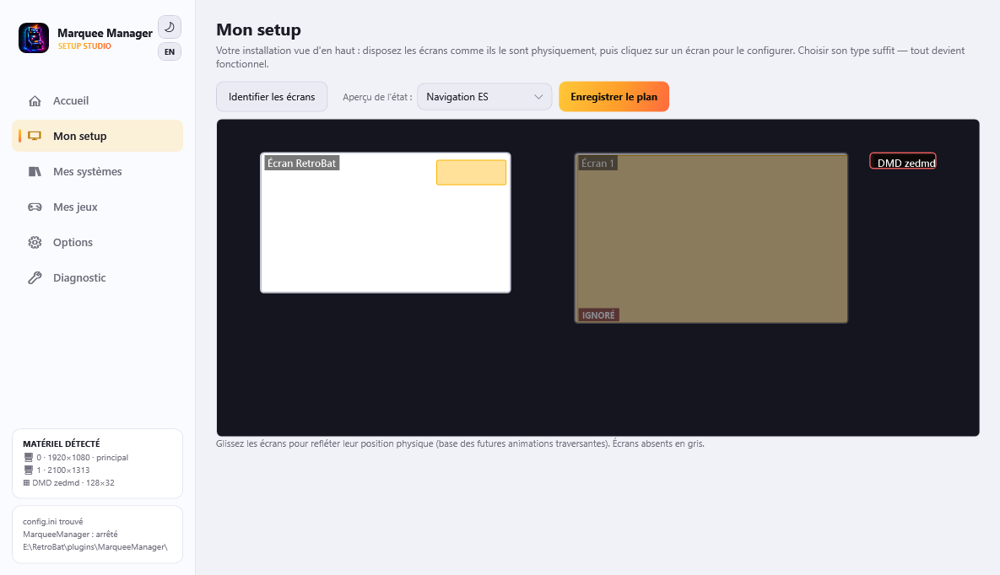

# My setup

**My setup** is the map of your installation: every detected screen appears where it physically sits (drag them to mirror your cabinet, cupboard or desk). From there, everything configures top-down: **the map → a screen → a surface → its graphic creation**.

## One screen type = everything configured

Click a screen, pick its **type**, apply: default surfaces, components and streams are laid out — the screen works immediately.

| Type | What gets laid out |
|---|---|
| **Marquee** | Fullscreen surface: game media, lighting render (neon tubes), lamps, hiscores, live score/timer, RetroAchievements |
| **Topper** | Fullscreen topper surface |
| **Instruction card** | The game's instruction card (touch supported when the screen is) |
| **Virtual DMD** | A fullscreen DMD window |
| **Mixed vertical** | Marquee strip on top + instruction card at the bottom, **RetroBat/the game stays visible in the middle** |
| **Game screen** | Nothing: RetroBat owns it |
| **Custom** | An empty surface to compose |

The tool pre-suggests the type from the screen's shape (a 5:1 strip is probably a marquee). Experts then tweak anything: “Split / position surfaces” opens the visual zone editor (drag, resize, magnetic guides), including on the main screen.

## Display states

Every **surface** and every component belongs to a state: **ES browsing**, **Ingame**, or both (default). An “ingame only” surface disappears entirely while browsing — e.g. nothing over ES on the RetroBat screen until a game runs. The state selector above the map previews what each screen will show in each situation; a surface's state is set in “Edit the surfaces” (Visible in: …).

!!! tip "Map navigation"
    A **first click** on a screen selects it and shows its details below; a **second click** opens the surfaces editor. The **physical DMD** appears as a map screen (draggable, red outline) — its second click opens its settings.

## A surface's graphic creation

A surface's “**Configure**” button opens the graphic creation interface, Photoshop logic:

- **left, the elements** by groups: media (fanart, 50 % logo, game video…), game info (title, year/publisher), live (hiscores, score, timer), RetroAchievements, decoration (readability gradient, text, embedded web, neon tubes) — plus one-click **composites**: *Marquee* (fanart+gradient+logo), *Full score*, *Live media*, *Twitch chat*;
- **center, the canvas** at the surface's real scale: drag, resize handle, magnetic guides, Del, Ctrl+D (duplicate), Ctrl+Z/Y (undo/redo) — with a real example game's media;
- **right, the layers** (eye to hide, padlock to lock, ↑↓ for z-order) and the **inspector**: layout (x, y, width, height as fractions — the creation survives any resolution change), content (visibility state, `{name}` `{year}` templates…), style.

The **ES browsing / Ingame** tabs at the top filter editing per state. A layer's **eye** means “shown in THIS state”: 👁 it is, ◌ it is absent from this state but present in the other, — it is off everywhere.

Four layers are **pinned** and cannot be deleted: **Animated events**, **Lamps** and **Lighting** at the top, the **Game image** at the very bottom. They cover the whole surface by definition and therefore do not move. Switching one off does more than hide it: its engine is **not built** and costs nothing at all.

The **live score, live timer and RetroAchievements** overlays belong to the **Ingame** state only: there is no score and no session to report while browsing. Their eye only switches them on or off.

!!! tip "A well-placed fanart"
    The Fanart preset covers the whole frame; the readability gradient sits above it and the centered logo takes 50 % of the width — the generated-marquee recipe, now editable.

!!! note "Live video"
    The video component can follow a **live Twitch stream > YouTube > local video** chain: if a live stream exists for the displayed game, it takes the video's place. Credentials in Options → Online sources; without keys, the local video simply shows.

### Text layers

**Meta text** shows the selected game's data through a template: `{name}`, `{year}`, `{developer}`, `{publisher}`, `{system}`, and everything else the entry carries — `{desc}`, `{genre}`, `{players}`, `{rating}`.

**Type size** defaults to *auto*: the text fits itself to its zone. That is what lets one layer carry a game name or a 1,500-character description without being told which. Set by hand, the size is a **fraction of the surface height** — so it keeps its size when you resize the zone.

The rest (*Style* group): **alignment** left / centered / right / justified, **vertical position** top / middle / bottom, and **weight** bold or normal — a 1,500-character description in bold is a wall.

### The control panel

The **Control panel** component (*Live* palette) draws your cabinet's panel, with what each button does in the **selected** game — being on its card in ES is enough, nothing has to be launched.

And above all: **press a button on the cabinet and it lights up on the panel**. That is a full wiring check, working **with LedManager not installed**. If the neighbouring button lights instead, the wiring is not what your cabinet declares.

Its options (inspector):

- **Panel** (*Content* group) — Player 1 to 4. One component = one panel: a two-sided cabinet places two, each set to its own side.
- **Look** (*Style* group) — *Top view* and *3D front view* show APIExpose's **real artwork**, the very drawing it writes for EmulationStation themes; *Plain* draws shapes. With no drawing available for a game, the look falls back to the shapes rather than to an empty frame.
- **Background** — none, black, white, red, yellow or blue, with its **opacity** and **padding** on sliders. The artwork is drawn on transparency: over a busy fanart, a veil makes the buttons readable.

Buttons the game **does not use** stay visible, faded: the panel tells the truth about the cabinet, not about the game. They still light when pressed, in white — having no colour of their own to answer with.

!!! note "The light"
    A press lights a **coloured lamp**, like the lighting engine's own: the button's colour, a soft halo, no outline. It stays lit for a minimum time even on a quick tap, then fades out — otherwise a rattle of buttons would read as flicker.

### Instruction cards

Many cabinets show the game's **instruction card**: special moves, items, bonus points. Two layers carry it, and they are separate on purpose — on a cabinet, the touchscreen and the screen showing the card are rarely the same one.

**Instruction card** (*Instruction cards* palette) shows the selected game's pages. Its options:

- **Player** — who this card is for. *All players* for a shared card.
- **Displayed role** — the role is the page's **folder** in the game media: a character (`cody`), a topic (`items-and-weaponry`), a stage. Left empty, the layer walks **every** page of the game.
- **Follow the character the game announces** — when the game can tell who was picked, the card switches to that character and cycles through **his** pages only.

**Touch zone** is the layer you press. Its rectangle **is** the zone: what you draw is what a finger can touch. Its options:

- **On tap** — next page, previous page, back to the first, show one page or one role, next/previous role, or follow / stop following the game.
- **Displayed text** and **Outline the zone** — nothing is drawn by default: a touchscreen that works needs no marking. Both settings are for cabinets whose players do not know the zone is there.
- **Auto return (ms)** — come back to the starting page after a delay.

!!! note "The channel, to bind the two"
    A zone drives the card carrying the **same channel**. The channel follows what the layer already says — its player, otherwise its role — so an ordinary cabinet has nothing to name: a card set to *Player 2* and a zone set to *Player 2* answer each other. The **Channel** field only matters for free-form setups: a touch strip on the marquee scrolling tips shown on the topper, for instance.

!!! tip "Where the pages come from"
    From the game's media folder, under `artwork\ic`: `ic.png` at the root, or `artwork\ic\<role>\ic-1.png` for a page belonging to a character or a topic. The folder name **is** the role.

### The score board

The **Hiscores** component shows the current game's leaderboard. Its options (inspector, *Content* group):

- **Source** — *Local hiscores* (scores captured on the cabinet), *NelfePlay (online)* (the game's certified **world Top 100**), or *Both*: the two boards show **one after another** (world first), displaying only the one that has data.
- **My best rank** — under each board, a line recalls **your** position: locally, your best line for the game; worldwide, your certified rank (or a prompt to identify on NelfePlay). The label is customizable (`{rank} {of} {score} {pseudo}`) and localized.
- **Rows per page** — a free number, or **Dynamic**: the count fits the available space (a wide, short marquee shows few; a taller zone more). Beyond N rows, the board cycles page by page.
- **Alignment** — the board sits at the **top / middle / bottom** of its zone.
- **Rank/score colour** — gold by default, a fixed colour, or **Auto**: a vivid colour pulled from the game logo/marquee.
- **Title** — `{name}` (or just `gamename`) = game name; the title is **decoupled** from the list (a long title no longer shrinks the score).
- A faint *local / world* **watermark** at the bottom tells which board is on screen right now.

## Test patterns, identification, DMD, touch

- **Identify screens** shows a big number on every physical screen.
- **Show test pattern** fills the selected screen with an adjustment grid.
- **Physical DMD…** opens the real panel settings (ZeDMD, Pin2DMD… see [DMD and ZeDMD](dmd.md)).
- **Touch (IC card)…** appears on touch screens: simple (one tap = next card), center→IC2, dual player (left half player 1, right half player 2) and mouse-drawn free zones. The mouse triggers the same actions — handy for testing.

!!! note "Card naming (APIExpose media)"
    In a game's `artwork\ic`: `ic.png` for a single card, or `ic-1.png`, `ic-2.png`… for several. The `-left`/`-right` suffixes (e.g. mercs: `ic-1-left.png` … `ic-5-right.png`) are the panel's **two card holders**: player 1 side and player 2 side. Navigation moves card by card, and dual player mode shows the side of the player who tapped.

## Under the hood

The map and surfaces live in `state\surfaces.json` (physical positions will drive future cross-screen animations). A legacy `[Screens]` configuration converts automatically on first launch with identical behavior; an unplugged screen stays on the map, grayed, and recovers its settings when plugged back. If APIExpose restarts, every stream reconnects by itself after five seconds.
